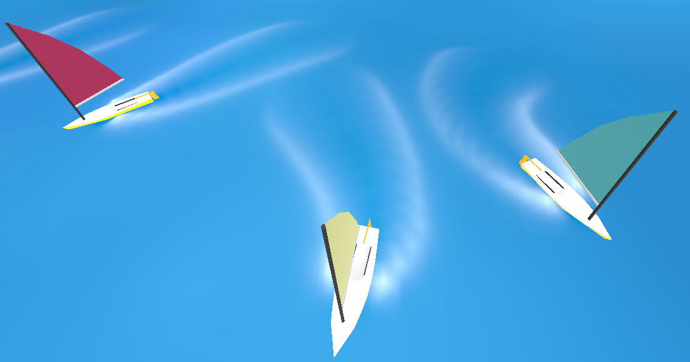

# water-animation-interaction-CSEBEP
Water Animation and Interaction code produced as a part of the TU/Delft Computer Science and Engineering Research Project CSE3000, 2022. 

Disclaimer: Currently only contains the pieces of code produced by me, these files are a small part of a much larger project and as such do not run on their own.

Clip-Map Mesh            |  Gerstner Waves           |  Dynamic Wakes       
:-------------------------:|:-------------------------: |:-------------------------:
  |   | 
